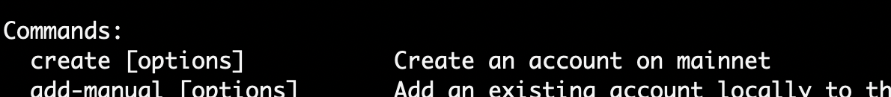
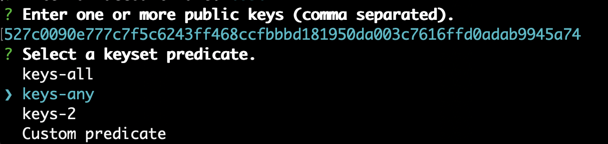

# Kadena CLI Feedback

## Scenario

Add a New Wallet and Fund an Account on Testnet

## Participants

Driver: Ghislain & Kristina

Reporter: Ghislain & Kristina

## Expectations

I wanted to create a wallet

## Outcome

- The driver got confused when having to enter the password confirmation (mostly by the wording) => Confirm password
- The program terminated when typing in non-matching passwords
- Unclear if the generated keypair is only shown in the terminal or also saved to a file?
- The password for creating the keys, is this the same password as for the wallet?
- Driver is confused if he should use Account or Transaction to transfer-create the account.
- create only usable on mainnet?
  
- Feels a bit odd that I have to select a keyset predicate when only providing 1 public key:
  
  [Did you have any prior knowledge about Kadena blockchain interactions]
- Driver is confused how they should select a network when creating an account.
- Driver got confused due to overlap in steps between Generate KeyPair and kadena account add-manual
- Driver is happy with the loading icon/feedback that the TX is in progress
- Driver is confused with an error: "Single-key account protocol violation"

Public: 527c0090e777c7f5c6243ff468ccfbbbd181950da003c7616ffd0adab9945a74
Private: ae9409d88ba99150fe8479a716e4c36b5727e1ccd1f82f830bdb405d1c1fc1a7

## Challenges

[Describe any difficulties faced during the scenario. Please be as explicit as possible]

## Additional Feedback

[Any other feedback or suggestions for improvement.]

## Errors

[Did you encounter any errors, please provide the error or stacktrace if any given]

## Reflection

[Was the outcome as expected? Reflect on any differences between your expectations and the actual outcome.]
